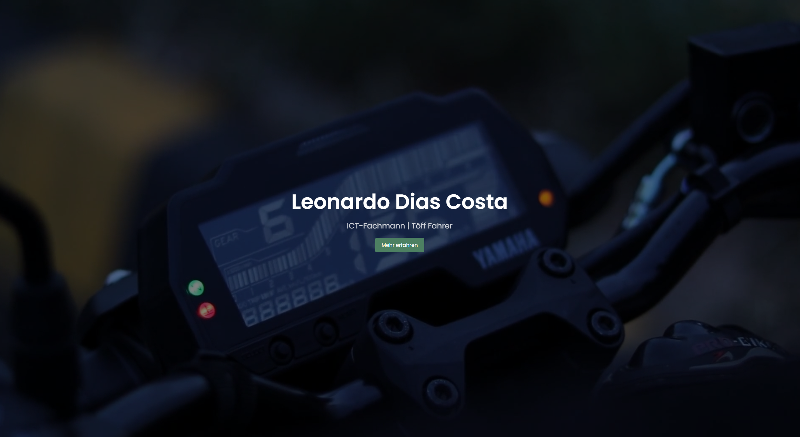

<h1 align="center">Ledicotech.ch
</h1>

 

<i>My small personal website and portfolio</i>

 </img>

## Checklist

| Status | Thing           |
|:------:|:----------------|
|   ✅    | Struktur        |
|   ✅    | blabla          |
|   ✅    | blabla          |
|   ❔    | blabla          |

### Contents:
---

#### Minimalistic ✨
- [Caneco](https://github.com/caneco/)

#### GIFS 👻
- [Pouya Saadeghi](https://github.com/saadeghi/saadeghi)

#### Just Images 🎭
- [Zack Krida](https://github.com/zackkrida/zackkrida)

#### Badges 🎫
- [Harish Kumar S S](https://github.com/harish-sethuraman/harish-sethuraman)

#### Fancy Fonts 🖋
- [xiaoluoboding](https://github.com/xiaoluoboding/xiaoluoboding)

#### Icons 🎯
- [Yuan Tang](https://github.com/terrytangyuan/terrytangyuan)

#### Retro 😎
- [Livio Brunner](https://github.com/BrunnerLivio/BrunnerLivio)
- [Christian Petersen](https://github.com/fnky/fnky)

## Tools
- [Todoist Stats in Readme](https://github.com/abhisheknaiidu/todoist-readme) - Daily Todoist Stats on your Profile Readme

## Articles

## Tutorials

## Special Thanks 🙇
- to my Mom :)

